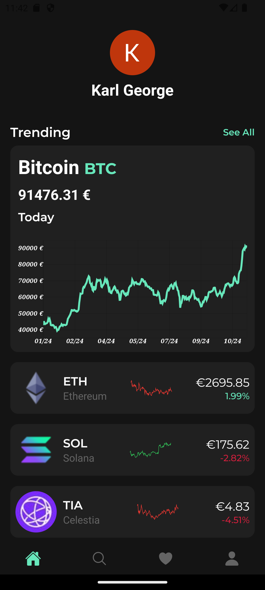
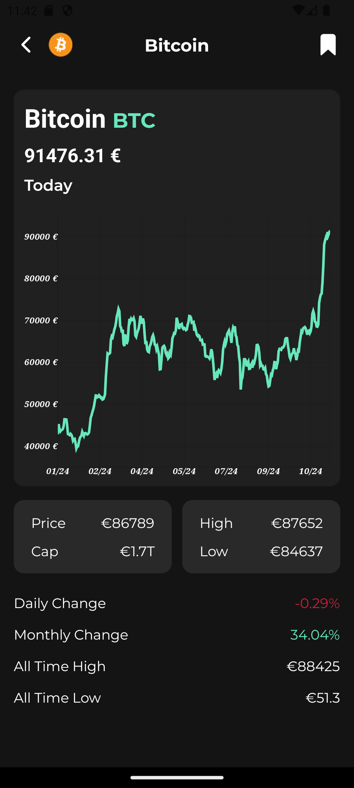
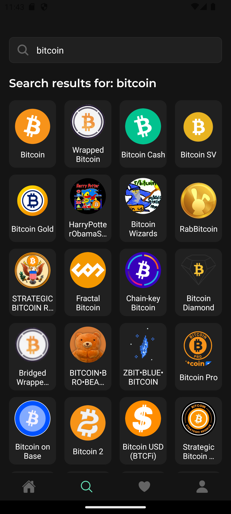
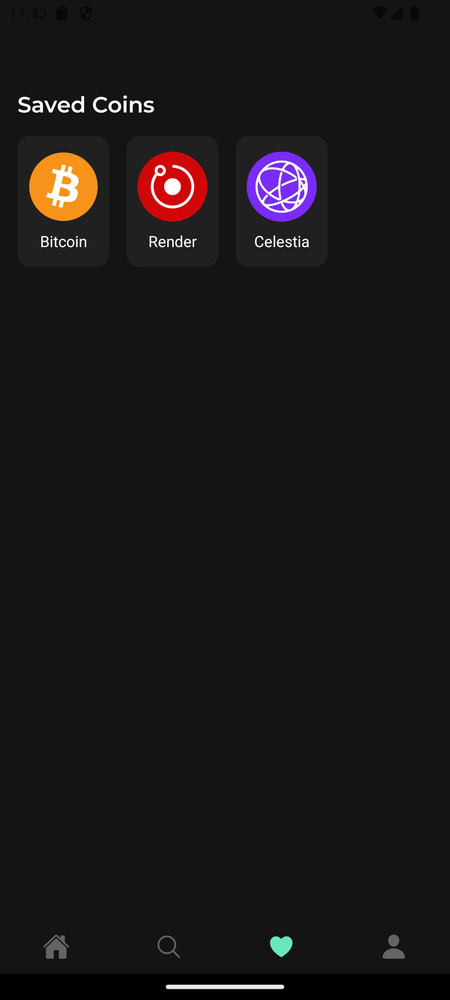

# CoinFlow

## Description

CoinFlow is a mobile application built with React Native and Expo that allows users to track current market data of various crypto currencies. The app features a modern design and a user-friendly interface, making it easy for users to find and save their preffered crypto coins.

## Features

- Discover the latest crypto coins
- Favourite your most viewed coins for easy access
- Keep track of how each coin is performing with detailed price charts
- Check a coins performance quickly with the coins spark lines

## Installation

1. Install the required dependencies: `npm install`
2. Start the app: `npx expo start`

## Screenshots

